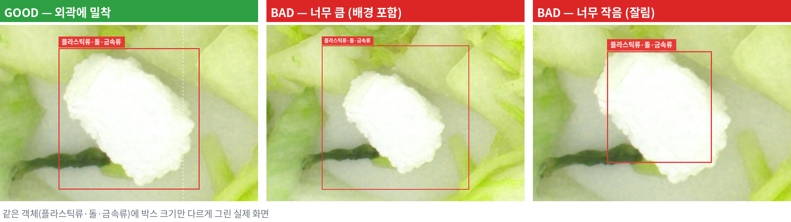
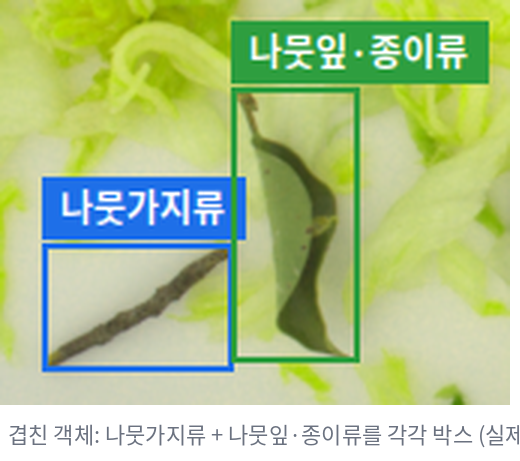
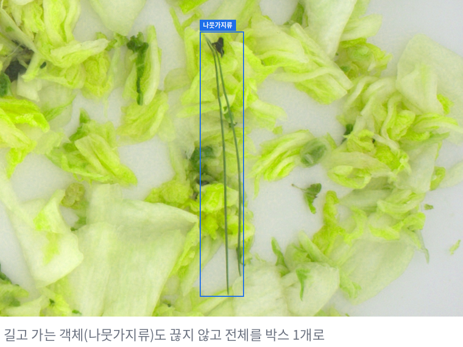
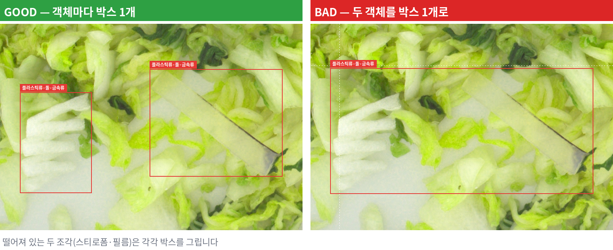
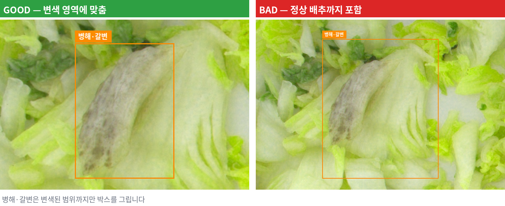

# Bounding Box Labeling Guide — 조각김치 이물검출

이미지 안의 객체를 **어디부터 어디까지 사각형으로 표시할지** 정하는 문서입니다.
작업자마다 BBox 크기가 다르면 같은 Class 라도 학습 데이터 품질이 흔들리므로, 아래 기준으로 통일합니다.

---

## 공통 원칙

- BBox 는 **객체의 실제 외곽에 최대한 밀착**합니다.
- 객체와 관계없는 배경(김치)을 지나치게 많이 넣지 않습니다.
- 가려진 객체는 **보이는 범위**를 기준으로 그립니다.
- **하나의 BBox 에는 하나의 객체**만 넣습니다.
- 판단이 어려우면 임의로 그리지 않고 Issue/Note 해당 사항 기입 후 REVIEW

---

## 1. 외곽 밀착

| GOOD | BAD |
|---|---|
| 객체의 가장 바깥 픽셀에 맞닿게 | 주변 김치를 많이 포함 (너무 큼) |
| 네 변 모두 객체 끝에서 1~2px 이내 | 객체 일부가 박스 밖으로 잘림 (너무 작음) |



**프로그램에서 맞추는 방법**

- 휠로 확대(Zoom)한 뒤 그리면 정확합니다. 확대해도 좌표는 원본 이미지 기준으로 저장됩니다.
- 모서리 핸들: 가로·세로 함께 / 테두리(변) 드래그: 그 방향만 조절
- 미세 조절: `Ctrl + 방향키` 그 방향으로 늘림, `Alt + 방향키` 반대쪽 변을 밀어 줄임 (0.0005 단위)
- `Tab` 으로 박스를 하나씩 선택하면 그 박스로 화면이 이동하므로, 확대한 채로 전체 박스를 점검할 수 있습니다.

---

## 2. 이미지 경계에 걸린 객체

- 이미지 밖으로 일부가 나간 객체는 **화면에 보이는 부분까지만** 그립니다.
- 박스는 이미지 밖으로 나갈 수 없습니다 (프로그램이 경계에서 멈춤, Validation '**BBox 경계 오류**' 로 검사).

---

## 3. 겹친 객체

- 서로 겹쳐 있어도 각각 구분할 수 있으면 **객체마다 별도 BBox** 를 그립니다. 박스끼리 겹쳐도 괜찮습니다.
  - 예: 나뭇가지 위에 비닐 조각 → Class 2 박스 1개 + Class 1 박스 1개



- 같은 객체에 박스가 두 번 그려지지 않게 합니다. Validation '**중복 의심 BBox**' (같은 Class, 겹침 90% 이상) 로 검사합니다.
- 어디까지가 한 객체인지 나눌 수 없으면 Issue/Note 해당 사항 기입 후 REVIEW (`object_separation_ambiguous`)

---

## 4. 작은 객체

- 작아도 **Class 를 알아볼 수 있고 검출 대상이면** BBox 를 그립니다.
- 확대해도 점·얼룩처럼 형태를 알 수 없으면 그리지 않거나 Issue/Note 해당 사항 기입 후 REVIEW (`too_small_to_identify`)
- 실수로 클릭만 해서 생긴 아주 작은 박스는 Validation '**Width/Height 비정상 — 너무 작음**' 경고로 찾아서 지웁니다.

---

## 5. 일부가 가려진 객체

- 김치·다른 객체에 일부가 가려져도 Class 를 알 수 있으면 **보이는 범위** 로 그립니다.
- 가려진 부분을 상상해서 박스를 키우지 않습니다.
- Class 를 알 수 없을 만큼 가려졌으면 Issue/Note 해당 사항 기입 후 REVIEW (`occlusion_ambiguous`)

---

## 6. 하나의 객체는 하나의 BBox

- 하나의 긴 나뭇가지·파 줄기 → BBox 1개 (잘려 보인다고 2개로 나누지 않음)



- 실제로 떨어져 있는 별개의 조각이면 각각 BBox



- 변색(Class 5)은 이어진 변색 영역 하나를 1개 박스로, 떨어진 반점들은 각각
- 변색 영역 주변의 정상 배추까지 넓게 잡지 않습니다.



---

## 7. 객체가 없는 이미지

- 검출 대상이 없으면 박스를 그리지 않고 저장합니다 → **빈 TXT** (배경 이미지, 정상)
- Scene Type 을 '정상 김치' 로 고르면 됩니다. Validation 에서는 'Empty Label(참고)' 로만 표시됩니다.

---

## 8. 판단이 어려운 경우

범위나 객체 구분이 애매하면 임의로 정하지 않고 Issue/Note 해당 사항 기입 후 REVIEW

| 이유 코드 | 상황 |
|---|---|
| `bbox_boundary_ambiguous` | 객체 경계가 흐려서 어디까지 그려야 할지 모름 |
| `object_separation_ambiguous` | 한 객체인지 여러 객체인지 나눌 수 없음 |
| `too_small_to_identify` | 너무 작아서 객체인지 알 수 없음 |
| `occlusion_ambiguous` | 많이 가려져서 Class·범위를 알 수 없음 |
| `class_ambiguous` | 범위는 명확하지만 Class 가 애매함 (`docs/class_guide.md`) |

---

## 작업 예시

```
나뭇가지 발견 → 휠로 확대 → 외곽에 밀착해 드래그 → Enter 확정
→ 숫자키 2 (나뭇가지류) → Tab 으로 다른 박스 점검 → 저장

나뭇가지 + 비닐이 겹침 → 각각 식별 가능 → 박스 2개 (Class 2, Class 1)

작은 갈색 물체 → 객체인지 얼룩인지 불명확 → 박스 확정하지 않음 → Issue/Note 해당 사항 기입 후 REVIEW (too_small_to_identify)
```
