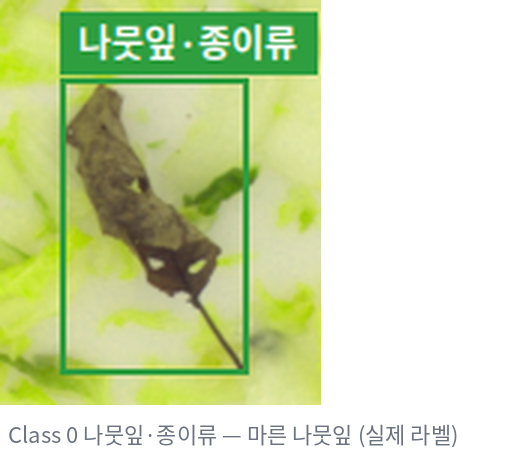
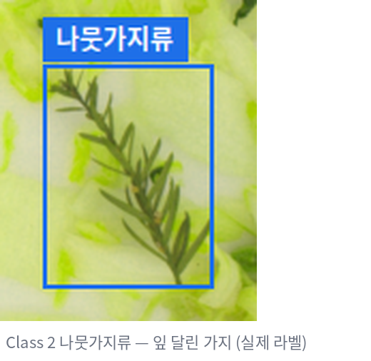
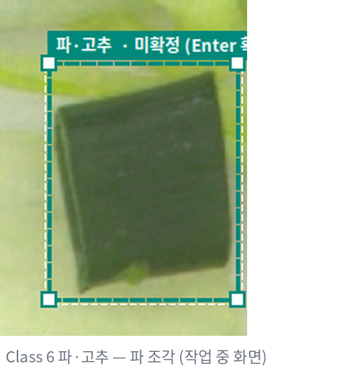
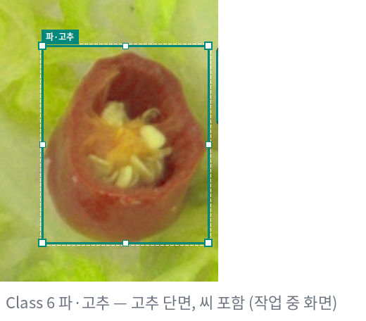

# Class Labeling Guide — 조각김치 이물검출

라벨링할 때 **"이 객체를 몇 번 Class 로 저장하는가?"** 를 팀원 모두가 같은 기준으로 판단하기 위한 문서입니다.
프로그램은 `configs/classes.yaml` 을 읽어 Class 목록·색상을 표시하며, 이 문서와 번호가 같아야 합니다.

---

## 공통 원칙

- 사용 Class: **0, 1, 2, 3, 5, 6** (Class 4 는 번호만 남기고 사용하지 않음)
- **김치(배추·무 등 김치 재료 자체)는 검출 대상이 아닙니다.** 김치 위의 이물·대상만 라벨링합니다.
- 판단이 명확한 객체만 해당 Class 로 지정합니다.
- 두 Class 중 어느 쪽인지 확신이 없으면 무엇이 애매한지 Issue/Note 에 적습니다.
  - 작업자·1차 검수자: REVIEW 선택 가능 → 2차 검수자가 최종 판단
  - 2차 검수자: REVIEW 가 없으므로 팀장·검수자와 확인 후 확정
- Class 를 바꿨으면 상태는 **EDITED** 입니다 (박스를 고치면 프로그램이 자동으로 EDITED 로 바꿈).

| ID | 이름 | 화면 색 | 단축키 | 사용 |
|---:|---|---|:---:|:---:|
| 0 | 나뭇잎·종이류 | 초록 | `0` | ○ |
| 1 | 플라스틱류·돌·금속류 | 빨강 | `1` | ○ |
| 2 | 나뭇가지류 | 파랑 | `2` | ○ |
| 3 | 벌레류 | 보라 | `3` | ○ |
| 4 | 고무장갑 | 회색 | — | ✕ |
| 5 | 병해·갈변 | 주황 | `5` | ○ |
| 6 | 파·고추 | 청록 | `6` | ○ |

---

## Class 0 — 나뭇잎·종이류

**대상**: 김치 사이에 섞인 나뭇잎 또는 종이 형태의 이물

| 포함 | 제외 |
|---|---|
| 나뭇잎, 잘린 잎 조각, 낙엽 | 김치 배춧잎 (연두·흰색, 두꺼운 잎맥) |
| 종이·포장지·라벨 조각 | 파 잎 (→ Class 6) |
| 얇고 평평한 비닐처럼 보이지 않는 종이류 | 비닐·플라스틱 필름 (→ Class 1) |

**애매한 경우**: 나뭇잎인지 김치 잎 조각인지 색·잎맥으로 구분이 안 되면 Issue/Note 해당 사항 기입 후 REVIEW

**실제 예시**



---

## Class 1 — 플라스틱류·돌·금속류

**대상**: 플라스틱, 비닐, 돌, 금속처럼 제조·포장 과정에서 들어간 무기물 이물

| 포함 | 제외 |
|---|---|
| 플라스틱 조각, 비닐·필름, 끈 | 나뭇가지 (→ Class 2) |
| 돌, 모래 덩어리 | 양념 덩어리, 고춧가루 뭉침 |
| 금속 조각, 철사, 스테이플러 심 | 식물성 잎·줄기 |

**애매한 경우**: 반사·색만으로 재질(플라스틱/종이/돌)을 판단하기 어려우면 Issue/Note 해당 사항 기입 후 REVIEW

**실제 예시**


---

## Class 2 — 나뭇가지류

**대상**: 막대·가지 형태의 단단한 나무성 이물

| 포함 | 제외 |
|---|---|
| 나뭇가지, 작은 가지 조각 | 파 줄기 (속이 비고 흰색~초록, → Class 6) |
| 목질 줄기, 이쑤시개처럼 생긴 나무 조각 | 고추 꼭지 (→ Class 6) |
| 짚·볏짚 조각 | 배추 심지 조각 (김치 재료) |

**애매한 경우**: 갈색으로 변한 채소 줄기인지 나뭇가지인지 구분이 안 되면 Issue/Note 해당 사항 기입 후 REVIEW (Class 5 와 헷갈리는 경우 포함)

**실제 예시**



---

## Class 3 — 벌레류

**대상**: 형태로 벌레·곤충임을 알아볼 수 있는 객체

| 포함 | 제외 |
|---|---|
| 벌레, 애벌레, 곤충 (일부만 보여도 다리·몸통이 식별되면 포함) | 작은 검은 점, 얼룩 |
| 날파리 등 작은 곤충 | 양념·깨·고춧가루 알갱이 |
| | 형태를 알아볼 수 없는 작은 이물 |

**애매한 경우**: 벌레인지 단순 반점인지 확대(휠 Zoom)해도 판단이 안 되면 Issue/Note 해당 사항 기입 후 REVIEW

**실제 예시**: (예시 이미지 추가 필요 — 벌레류가 라벨된 이미지 캡처)

---

## Class 4 — 고무장갑 (사용 안 함)

- 현재 프로젝트에서 **새로 만들지 않습니다.** 프로그램에서 선택할 수 없게 막혀 있습니다.
- 학습 설정과 번호가 어긋나지 않도록 **ID 4 는 비워 둔 채 유지**합니다 (5, 6 번을 당기지 않음).
- 기존 TXT 에서 Class 4 가 나오면 (프로그램에서 회색, Validation '**Class 4 발견**' 오류):
  1. 임의로 지우지 않습니다.
  2. 실제 객체가 다른 Class 로 명확하면 → 그 Class 로 바꾸고 EDITED
  3. 객체가 아니거나 판단이 어려우면 → Issue/Note 해당 사항 기입 후 REVIEW 로 올려 2차 검수자가 삭제 여부 결정
- Class 4 가 남아 있으면 PASS · REVIEWED 로 저장할 수 없습니다 (프로그램이 막음).

---

## Class 5 — 병해·갈변

**대상**: 배추에 생긴 병해 반점 또는 갈색으로 변색된 부위

| 포함 | 제외 |
|---|---|
| 갈색·검은색 또는 무름·곰팡이처럼 보이는 이상 부위 | 그림자, 조명 반사로 어두워진 부분 |
| 반점이 모인 영역 (변색 범위 전체를 한 박스로) | 갈색 나뭇가지 (→ Class 2) |

**애매한 경우**: 실제 갈변인지 조명·그림자인지 판단하기 어려우면 Issue/Note 해당 사항 기입 후 REVIEW

**실제 예시**: (예시 이미지 추가 필요 — 병해·갈변이 라벨된 이미지 확대 캡처)

---

## Class 6 — 파·고추

**대상**: 조각김치 이미지에서 검출 대상으로 지정된 파 또는 고추 조각

| 포함 | 제외 |
|---|---|
| 파 조각 (초록 잎, 흰 줄기, 둥근 단면) | 배춧잎·무 (김치 재료) |
| 고추 조각, 고추 단면 (씨 포함), 고추 꼭지 | 나뭇잎 (→ Class 0) |
| | 나뭇가지 (→ Class 2) |

**애매한 경우**: 파 잎인지 나뭇잎인지, 파 줄기인지 나뭇가지인지 구분이 안 되면 Issue/Note 해당 사항 기입 후 REVIEW

**실제 예시**

| 파 조각 | 고추 단면 (씨 포함) |
|---|---|
|  |  |

---

## 자주 헷갈리는 조합

| 헷갈리는 조합 | 구분 포인트 |
|---|---|
| 0 나뭇잎 ↔ 6 파 잎 ↔ 김치 잎 | 파 잎은 둥글고 속이 빈 관 모양, 김치 잎은 두꺼운 흰 잎맥, 나뭇잎은 얇고 잎맥이 가지처럼 퍼짐 |
| 2 나뭇가지 ↔ 6 파 줄기·고추 꼭지 | 나뭇가지는 단단·불투명한 갈색, 파 줄기는 흰~연두 반투명, 고추 꼭지는 초록 별 모양 |
| 2 나뭇가지 ↔ 5 갈변 | 길쭉한 독립 객체면 2, 배추 표면의 변색 영역이면 5 |
| 3 벌레 ↔ 검은 점 | 다리·몸통 마디가 보이면 3, 형태가 없으면 라벨하지 않거나 Issue/Note 해당 사항 기입 후 REVIEW |
| 1 플라스틱 ↔ 0 종이 | 반사·투명하면 1, 섬유질·불투명하면 0 |

---

## 판단 흐름 예시

```
객체 발견 → 확대해서 형태·색 확인
        ↓
이 문서의 포함 / 제외 기준 확인
        ↓
명확함 → BBox 작성 → Class 지정 (숫자키) → 저장
애매함 → 임의로 정하지 않음 → Issue/Note 해당 사항 기입 후 REVIEW
        ↓
2차 검수자가 최종 판단
```
